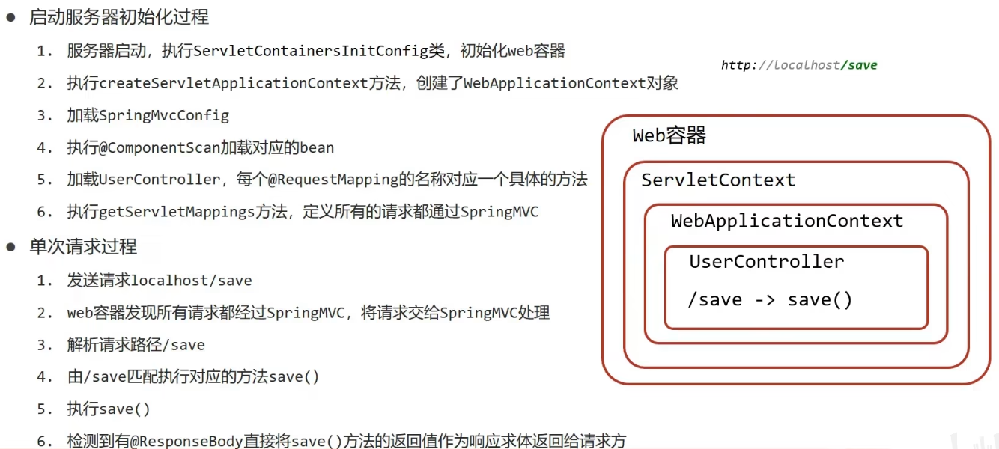

# SpringMVC-Learning

SpringMVC是一种基于Java实现的MVC模型的轻量级Web框架

SpringMVC技术与Servlet技术功能等同，均属于Web层开发技术

## 请求与相应

## REST风格

## SSM整合

### springmvc入门
  
1. 配置Tomcat ，导包 (本地Tomcat/Tomcat插件)  

Tomcat插件只支持到7这个版本
```xml
  <build>
    <finalName>SpringMVC01</finalName>
    <plugins>
      <plugin>
        <groupId>org.apache.tomcat.maven</groupId>
        <artifactId>tomcat7-maven-plugin</artifactId>
        <version>2.2</version>
        <configuration>
          <port>80</port>
          <path>/</path>
        </configuration>
      </plugin>
    </plugins>
  </build>
```

依赖
```xml
  <dependencies>
    <dependency>
      <groupId>javax.servlet</groupId>
      <artifactId>javax.servlet-api</artifactId>
      <version>3.1.0</version>
      <scope>provided</scope>
    </dependency>
    <dependency>
      <groupId>org.springframework</groupId>
      <artifactId>spring-webmvc</artifactId>
      <version>5.2.10.RELEASE</version>
    </dependency>
  </dependencies>
```

2. 定义Controller

使用@Controller注解定义bean
```java
@Controller
public class UserController {
    // 设置当前操作的访问路径
    @RequestMapping("/save")
    // 设置当前操作的返回值类型，把返回的东西整体作为内容返回
    @ResponseBody
    public String save(){
        System.out.println("user save...");
        return "{'module':'springmvc'}";
    }
}
```

3. 创建SpringMVC配置文件，加载Controller对应bean

```java
@Configuration
@ComponentScan("com.mvc.controller")
public class SpringMvcConfig {
}
```

4. 定义一个Servlet容器配置类，在里面加载Spring的配置

方式一：
```java
public class ServletContainsConfig extends AbstractAnnotationConfigDispatcherServletInitializer{
    @Override
    protected Class<?>[] getRootConfigClasses() {
        return new Class[]{SpringConfig.class};
    }

    @Override
    protected Class<?>[] getServletConfigClasses() {
        return new Class[]{SpringMvcConfig.class};
    }

    @Override
    protected String[] getServletMappings() {
        return new String[]{"/"};
    }
}
```

方式二：
```java
public class ServletContainsConfig extends AbstractDispatcherServletInitializer {
    // 加载SpringMVC容器
    @Override
    protected WebApplicationContext createServletApplicationContext() {
        AnnotationConfigWebApplicationContext ctx = new AnnotationConfigWebApplicationContext();
        ctx.register(SpringMvcConfig.class);
        return ctx;
    }

    // 设置哪些请求归属SpringMVC处理
    @Override
    protected String[] getServletMappings() {
        return new String[]{"/"};
    }

    // 加载spring容器配置
    @Override
    protected WebApplicationContext createRootApplicationContext() {
        return null;
    }
}
```


